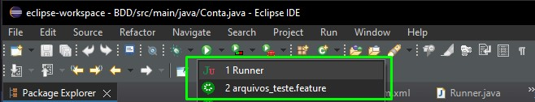
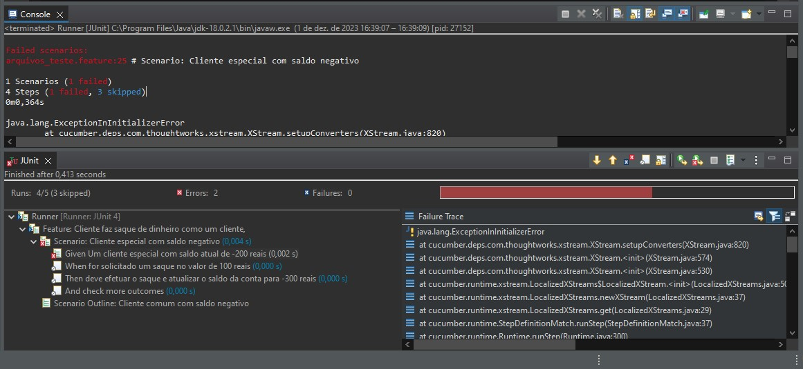
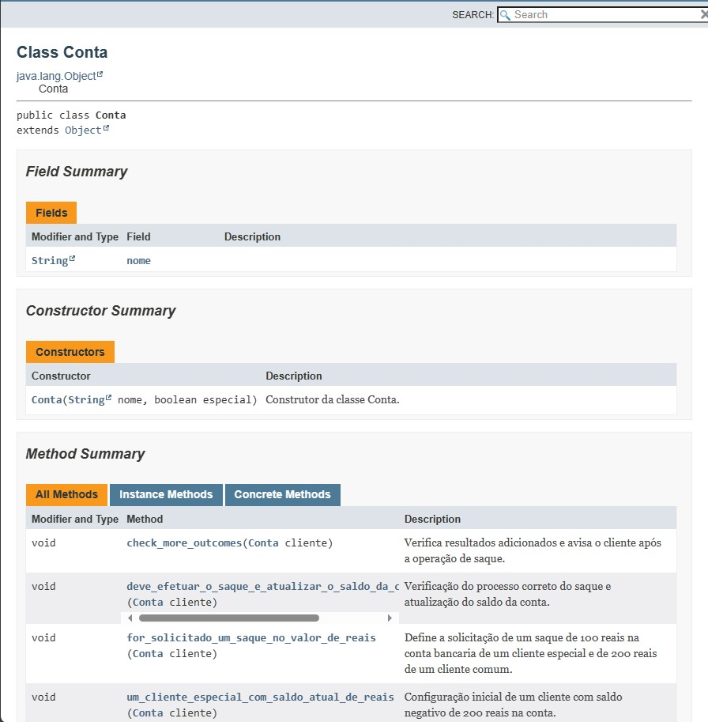
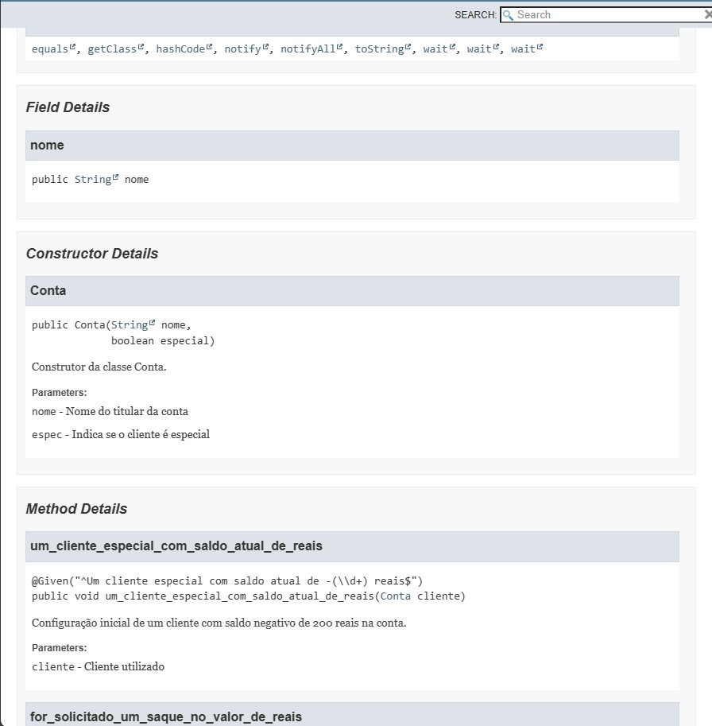
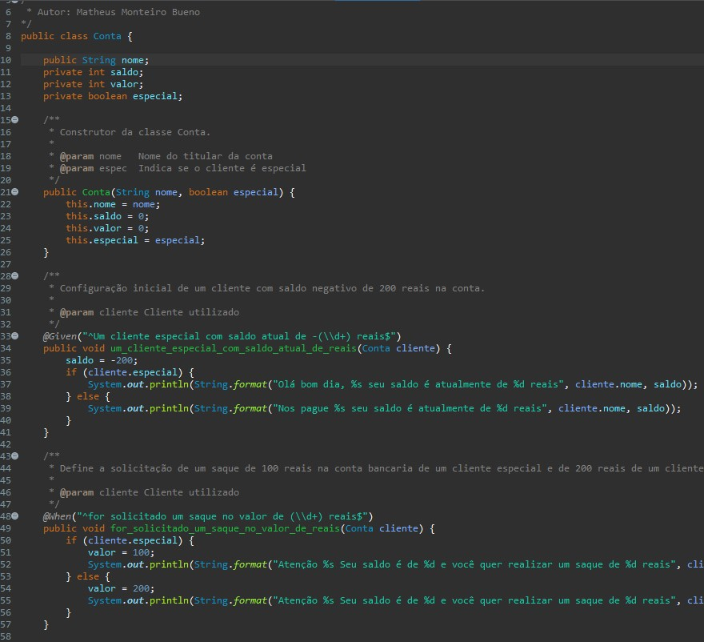

# BDD - Conta Bancária

## Autor: ronald domynik dos santos

## Versão: 0.1

## Descrição do projeto

O projeto consiste em uma classe Conta que simula uma conta bancária. Para essa conta foram implementados testes com a biblioteca Cucumber. Também foi documentada através da exportação dela com Javadoc.

## Pré-requisitos

- [Java](https://www.java.com/pt-BR/)
- [Maven](https://maven.apache.org/)
- IDE Java de preferência. No caso, está sendo utilizado o Eclipse

## Como rodar a aplicação

### 1. Clone o repositório

Através do GIT Bash, execute o seguinte comando para obter os arquivos do projeto:

```bash
git clone https://github.com/MatthMiller/BDDContaBancaria.git
```

### 2. Rode os testes utilizando o jUnit Runner, ou através do Cucumber Feature



Imagem abaixo da execução dos testes através do jUnit Runner:



## Documentação através do Javadoc

Imagens do Javadoc gerado da classe Conta:



<br>



## Printscreen da classe Conta



## Linguagens, dependências e bibliotecas

- Java
- Maven
- Cucumber
- JUnit

## Desenvolvedor: Matheus Monteiro Bueno
